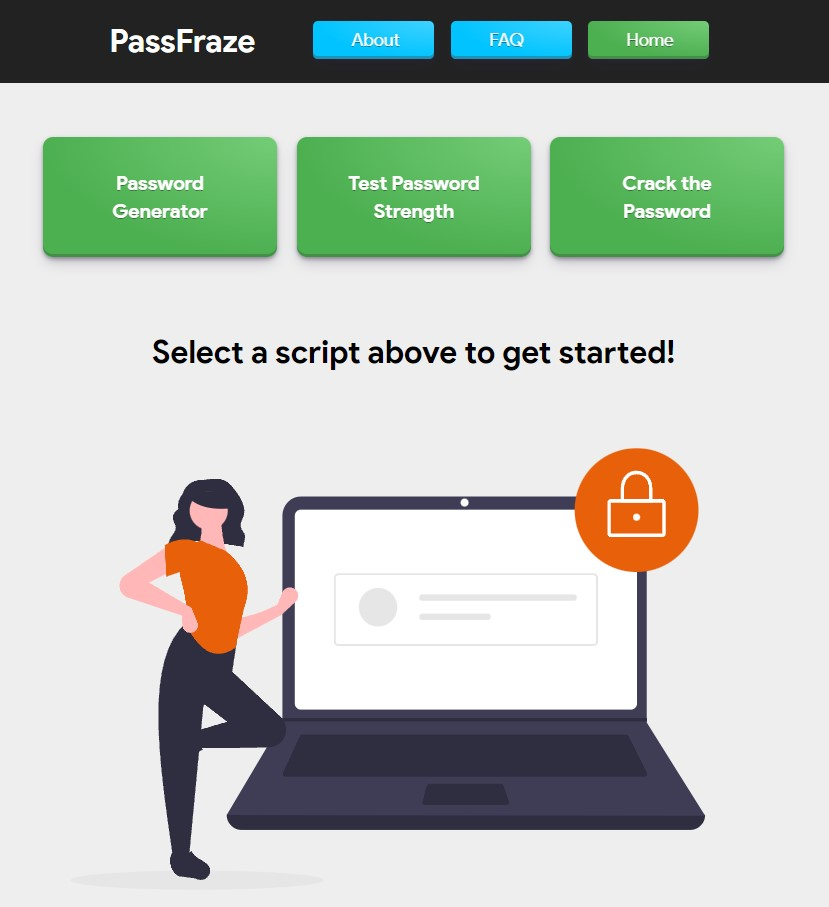

# PassFraze

PassFraze is a versatile 3-in-1 password tool that allows users to generate secure passwords, crack weak passwords, and analyze password strength. It is implemented with a user-friendly web interface using Flask for Python.<br>




## Features

- **[Password Generation](#password-generation)**: Create strong and unique passwords based on specified criteria such as length, character types, and complexity.
  
- **[Password Cracking](#password-cracking)**: Test the strength of passwords by simulating common cracking techniques to identify weak passwords.
  
- **[Password Analysis](#password-analysis)**: Evaluate the strength of existing passwords by analyzing factors such as length, character diversity, and vulnerability to common attacks.
  
## Technologies Used

- **Languages**:
  - Python
  - JavaScript
  - HTML
  - CSS
  
- **Framework**: [Flask](https://flask.palletsprojects.com/)

## Installation

To run PassFraze locally, follow these steps:

1. Clone the repository:
   ```bash
   git clone https://github.com/your-username/passfraze.git
   cd passfraze

2. Install dependencies
3. Run Flask Application:
   ```bash
   python app.py
4. Access Flask Application in your preferred web browswer 'http://localhost:5000'.

## Usage
### Password Generation:
- Navigate to the "Generate Password" section.
- Specify the desired length and complexity of the password.
- Click "Generate" to create a new password.
### Password Cracking:

- Visit the "Crack Password" section.
- Enter the password you wish to test.
- Click "Crack" to simulate common cracking techniques and receive a report on the password's strength.
### Password Analysis:
- Explore the "Analyze Password" section.
- Enter the password you want to analyze.
- Click "Analyze" to receive insights into the password's strength and areas for improvement.

## Acknowledgements
- PassFraze was created by Anton Vulman.
- Special thanks to the Flask community for their excellent web framework.
